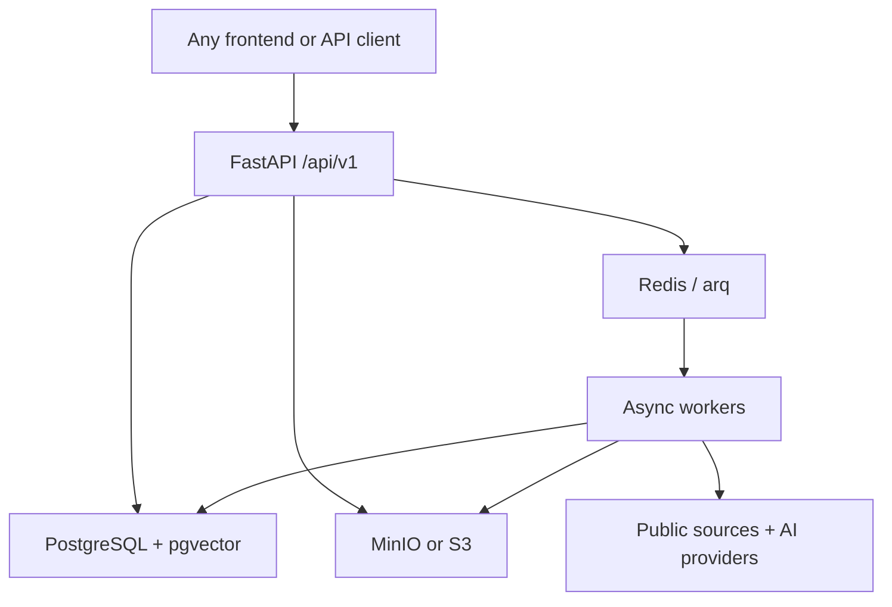

# VC Brain backend (DOLPHIN)

Runnable, frontend-agnostic backend for the Maschmeyer Group × Hack-Nation challenge: source founders, screen opportunities, perform evidence-backed diligence, and support a human investment decision within 24 hours.

The service is built with Python 3.12, FastAPI, SQLAlchemy, PostgreSQL/pgvector, Redis/arq, and MinIO. Any web, mobile, desktop, or automation client can integrate through REST, multipart uploads, OpenAPI 3.1, and Server-Sent Events (SSE).

## What is implemented

- Multi-tenant organizations, users, JWT access tokens, Argon2id passwords, rotating opaque refresh tokens, reuse detection, service tokens, API-key support, and role-based permissions.
- Configurable fund theses with sectors, stages, geography, check size, ownership, risk appetite, must-haves, and deal breakers.
- Inbound authenticated and public applications with PDF/PPTX storage, upload validation, application tracking, deduplication, and a literal 24-hour SLA clock.
- Shared opportunity pipeline for parsing, claim extraction, evidence locators, per-claim Trust Scores, independent Founder/Market/Idea-vs-Market axes, thesis fit, recommendation, and a memo that explicitly marks gaps.
- Persistent, event-sourced Founder Scores with confidence intervals, cold-start behavior, score history, explanations, and uplift plans.
- Outbound connector seams for GitHub, Hacker News, arXiv, and Tavily; LLM gateway seams for OpenAI and NVIDIA NIM with deterministic operation when no key is configured.
- Background jobs, arq workers, scheduler/reaper, resumable SSE traces, idempotency handling, optimistic concurrency, sourcing-channel graph, outreach approval, metrics, and health/readiness endpoints.
- Alembic migration, reproducible demo seed, Docker Compose environments, CI, smoke test, OpenAPI snapshot, and unit/contract/integration/security/resilience tests.

There is deliberately no `overall_score`: the three screening axes remain independent everywhere, including the API schema.

## Quick start

Requirements: Docker with Compose v2.

Create and configure the environment file once:

```bash
cp .env.example .env
# Set SECRET_KEY, POSTGRES_PASSWORD, and S3_SECRET_KEY.
```

After `.env` is configured, start the complete backend stack:

```bash
docker compose up --build -d
docker compose ps
curl --fail http://localhost:8000/readyz
```

Optionally load the deterministic demo organization, user, thesis, and opportunity:

```bash
make seed
```

Then open:

- API: `http://localhost:8000/api/v1`
- Swagger: `http://localhost:8000/docs`
- OpenAPI: `http://localhost:8000/api/v1/openapi.json`
- MinIO console: `http://localhost:9001`
- Liveness: `http://localhost:8000/healthz`
- Readiness: `http://localhost:8000/readyz`

Demo credentials after `make seed`:

```text
demo@vcbrain.dev / Demo-password-42!
```

The committed `.env` contains local-only, non-production values so the project can start immediately. It is ignored by Git. Replace all credentials before any shared or public deployment.

## Commands

```bash
make up          # build and start db, Redis, MinIO, API, worker, scheduler
make logs        # follow API and worker logs
make migrate     # apply Alembic migrations
make seed        # load the deterministic demo fund/opportunity
make test        # run the isolated Compose test stack
make test-unit   # run fast local unit + contract tests
make lint        # ruff
make typecheck   # strict mypy on services and schemas
make openapi     # regenerate docs/openapi.json
make down
```

## Query-driven harvesting

Harvesting is initiated on demand rather than on a daily schedule. An authenticated frontend or API client sends a search query to:

```http
POST /api/v1/admin/harvest
Authorization: Bearer <access-or-service-token>
Content-Type: application/json
```

Example request body:

```json
{
  "query": "AI healthcare startups in Germany",
  "channels": "auto",
  "limit": 25
}
```

The endpoint returns a `job_id`. Subscribe to `/api/v1/jobs/{job_id}/events` for live progress or poll `/api/v1/jobs/{job_id}`. The existing Redis/arq worker performs harvesting asynchronously. Set `DEMO_MODE=false` to enable real network harvesting; Tavily additionally requires `TAVILY_API_KEY`.

## Architecture



PostgreSQL is the source of truth. Redis is disposable queue/cache state. Blob keys and provenance live in PostgreSQL; binary data lives in MinIO/S3. Services contain business logic and do not import FastAPI, so the same pipeline can be called by HTTP routes, workers, tests, or an automation platform.

See [architecture.md](docs/architecture.md) for the domain flow and failure modes.

## Frontend integration

No frontend code or framework is included. The integration contract is standard HTTP:

1. Call `POST /api/v1/auth/signup` or `/auth/login`.
2. Keep the short-lived access token in memory and send `Authorization: Bearer …`.
3. Use the rotating refresh token body for CLI/native clients. Browsers can use the HttpOnly cookie plus the double-submit `X-CSRF-Token` header.
4. Submit an application as `multipart/form-data` to `POST /api/v1/applications` with `company_name`, a PDF/PPTX `deck` (or `website`), and `Idempotency-Key`.
5. Subscribe to `/api/v1/jobs/{job_id}/events` for progress, or poll `/jobs/{job_id}`.
6. Render the three `axes` separately and treat `thesis_fit` as a fourth, separately labelled value.
7. Render every claim’s `trust_score`, `status`, and evidence locator. Display memo `gaps`; never turn them into guessed values.

Generate client types from [openapi.json](docs/openapi.json). Full examples and CORS guidance are in [frontend-integration.md](docs/frontend-integration.md).

## Configuration

All runtime configuration is environment-based and documented in `.env.example`.

| Area | Important variables |
|---|---|
| Core | `ENV`, `SECRET_KEY`, `FRONTEND_ORIGINS`, `DECISION_SLA_HOURS` |
| Data | `DATABASE_URL`, `REDIS_URL` |
| Objects | `STORAGE_BACKEND`, `S3_ENDPOINT`, `S3_*`, `LOCAL_STORAGE_PATH` |
| AI | `OPENAI_API_KEY`, `NVIDIA_NIM_API_KEY`, model names, budget caps |
| Research | `TAVILY_API_KEY`, `GITHUB_TOKEN`, `CONTACT_EMAIL`, `USER_AGENT` |
| Behavior | `DEMO_MODE`, `QUEUE_EAGER`, `AUTO_CREATE_SCHEMA`, `ENABLE_WEB_FALLBACK` |
| Observability | `SENTRY_DSN`, `OTEL_EXPORTER_OTLP_ENDPOINT`, `GIT_SHA`, `BUILT_AT` |

Configuration files under `config/` provide explicit PostgreSQL, Redis, logging, and production Uvicorn/Gunicorn-style settings. In production, run Alembic and keep `AUTO_CREATE_SCHEMA=false`.

## Core invariants

- Founder score events are append-only. Corrections add a superseding event; history is not reset.
- Opportunity axes are stored as three versioned rows and never averaged.
- Trust belongs to a claim, not a company.
- Every extracted claim has evidence with an exact locator and literal source snippet.
- Missing memo information becomes `not_disclosed`/a gap, not a generated estimate.
- A cold start lowers confidence and widens the interval; absence does not lower the point estimate.
- A human, authenticated partner/owner performs the final decision.
- Every tenant-scoped lookup returns 404 for cross-organization identifiers.
- The original first-signal timestamp and SLA deadline are never reset.

## Tests

The test suite covers six layers:

- Unit: scoring math, trust arithmetic, extraction gates, connector normalization.
- Contract: OpenAPI resources, absence of `overall_score`, auth dependency coverage.
- Integration: signup/login/refresh, application-to-memo golden path, idempotent replay.
- Security: tenant isolation, SSRF ranges, refresh reuse, cold-start pass guard.
- Resilience: missing AI provider behavior and machine-readable degradation.
- Smoke: health, auth, a real list request, and the published OpenAPI document.

Run locally:

```bash
cd backend
pip install -e '.[dev]'
./scripts/run_tests.sh
python scripts/smoke_test.py --base-url http://localhost:8000
```

More detail is in [testing.md](docs/testing.md).

## Repository layout

```text
vcbrain/
├── .env / .env.example
├── docker-compose.yml / override / test
├── config/                     PostgreSQL, Redis, logging, server .conf files
├── backend/
│   ├── app/
│   │   ├── db/                 SQLAlchemy model and async sessions
│   │   ├── schemas/            Stable Pydantic/OpenAPI contract
│   │   ├── routers/            Thin HTTP adapters
│   │   ├── services/           Domain, scoring, parsing, providers, pipeline
│   │   └── workers/            arq worker and scheduler
│   ├── alembic/                Database migration
│   ├── scripts/                Seed, OpenAPI export, smoke and test scripts
│   └── tests/                  Unit through resilience tests
├── docs/                       Architecture, integration, testing, OpenAPI
└── Makefile                    Common development and operational commands
```

## Production extension points

The foundation runs end to end without external credentials. For a production deployment, connect an email provider for verification/reset delivery, an outbound mail adapter after human approval, production tracing/error reporting, and any licensed company/funding data sources permitted by their terms. Binary PDF/DOCX memo export is intentionally represented as an adapter boundary; Markdown memo content is already available through the API.