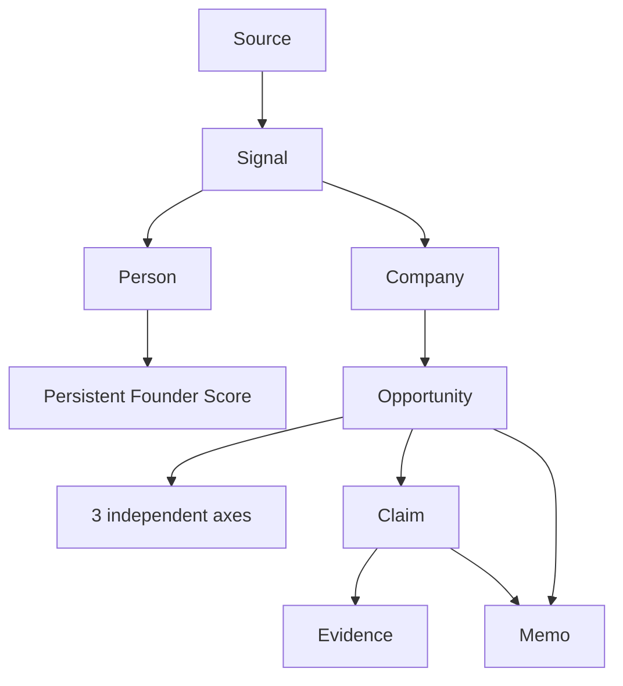
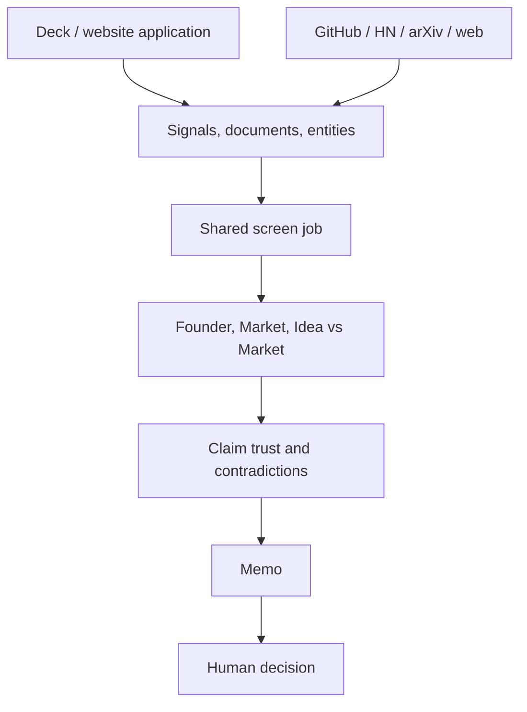

# Architecture and domain flow

## Boundaries

The repository owns Sourcing → Screening → Diligence → Decision. Portfolio monitoring, follow-on, fund operations, cap-table management, signatures, and money movement remain out of scope.

The backend is intentionally independent of a UI. HTTP routers validate/authorize and call services. Services contain business logic and never import FastAPI. arq workers call the same services. PostgreSQL is the only durable source of truth.

## Domain graph

A Person outlives any one company. An Opportunity is a company considered by one fund at one moment. This separation is what lets a Founder Score persist across multiple applications without leaking one fund’s private decisions into another tenant.

## Inbound and outbound convergence

Both tracks produce the same Opportunity and run through the same worker pipeline. Outbound investment is never automatic; outbound conviction can create a draft and outreach, while a human approves contact and the founder enters the same application funnel.

## Storage

- PostgreSQL: tenants, entities, signals, scores, claims/evidence, memos, jobs, audit trail.
- pgvector/PostgreSQL extensions: available for semantic retrieval and future vector backfills.
- Redis: arq queue, disposable cache/rate-limit state, worker coordination.
- MinIO/S3: uploaded decks and raw snapshots. Database rows retain hashes and object keys.

SQLite is supported only for isolated tests and local deterministic checks. Production uses PostgreSQL 16.

## Pipeline checkpoints

1. Prescreen: mechanical viability and duplicate checks.
2. Parse: PDF/PPTX pages stored independently.
3. Extract: deterministic baseline plus optional AI extraction; literal snippets are mandatory.
4. Score: three separate axis rows. Missing founder data uses a cohort prior at low confidence.
5. Thesis: hard gates and a separately reported fit value.
6. Recommend: rules handle contradictions, weak axes, disagreement, and low confidence.
7. Memo: required sections draw from claims; missing categories become explicit gaps.
8. Human decision: partner/owner action writes the decision clock and audit log.

Jobs and agent steps are durable. Redis loss does not lose queued work, and the reaper marks jobs with stale heartbeats for retry.

## Failure behavior

| Failure | Behavior |
|---|---|
| Source has no key | Source reports `no_credentials`; other sources continue. |
| Connector timeout/429/shape failure | Source degrades; job retains partial evidence. |
| No AI provider | Deterministic path remains available; AI calls return `SOURCE_UNAVAILABLE`. |
| Empty/partial deck | Parse status and memo gaps make the deficiency visible. |
| Prompt injection in evidence | Claim becomes `unverifiable`; text is not treated as an instruction. |
| Worker loss | Heartbeat reaper marks `WORKER_LOST`; durable job can be retried. |
| Redis loss | Existing queued rows stay in PostgreSQL for re-enqueue. |
| MinIO loss | Readiness degrades; uploads fail without corrupting database state. |
| SLA breach | Timestamp is retained and reported; the clock is never reset. |

## Security model

Access JWTs are short-lived and verified for issuer, audience, type, signature, and expiry. Refresh tokens are opaque, hashed at rest, single-use, and rotated by family; reuse revokes the family. Browser refreshes use HttpOnly/SameSite cookies plus a double-submit CSRF token. Machine clients can use scoped API keys or a service token bound to `X-Org-Id`.

Uploads are magic-byte checked and stored under random keys. User URLs are restricted to HTTP(S), resolved before use, and rejected if any result is private, loopback, link-local, reserved, or metadata space. CORS uses exact configured origins.

