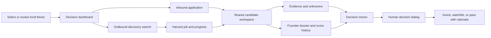

# Frontend revision guide

## Purpose and scope

This guide updates the frontend direction after the first `codex/revision-plan` backend amendment. It is framework-neutral and is intended to be used alongside [frontend-integration.md](frontend-integration.md), [README.md](../README.md), [architecture.md](architecture.md), [revision-plan.md](revision-plan.md), and [workflow.txt](workflow.txt).

The product should feel like a calm investor workspace. It should help an investor move from a source signal or application to an evidence-backed, human-made decision. It must not imply that the system has verified data, made an investment, sent outreach, or applied a thesis rule when the backend has not done so.

The current implementation is a strong foundation for the first end-to-end loop. It is not yet a complete implementation of every interaction described in the workflow. The frontend should make those boundaries explicit rather than hiding them behind polished but inactive controls.

## What changed on this branch

The current backend amendment changes the meaning of existing responses; it does not introduce a new public route or require a new generated OpenAPI client.

| Backend change | Frontend consequence |
| --- | --- |
| Every inbound application now creates or links a `Person`, founder affiliation, and cold-start Founder Score. | Candidate cards and workspaces should show the founder area immediately, including a low-confidence/cold-start state. Do not leave inbound candidates with an empty team panel by default. |
| An application without a contact name or email receives an explicit unresolved founder stub. | Show it as `Founder identity pending`, not as a confidently identified founder. A founder profile exposes `is_stub`; use it when the investor opens the dossier. |
| Harvested GitHub, Hacker News, arXiv, and web signals retain identity hints, resolve a person and company where possible, create an outbound opportunity, and append source-derived Founder Score events. | Add a real discovery flow and an `Outbound` queue filter. An outbound candidate should enter the same candidate workspace as an inbound candidate. |
| Each resolved source signal creates a knowledge-base chunk and channel edge. | Add an evidence search panel now. Do not build a full channel-edge graph yet because the current channel-graph response still returns `edges: []`. |
| A successful harvest creates one `screen` job per resolved candidate. The parent harvest job result contains `signals_ingested`, `candidates_resolved`, `screening_jobs`, and `failures`. | After the harvest job completes, refresh the outbound opportunity list. If detailed progress is needed, subscribe to the child job IDs returned in `result.screening_jobs`. |

## Product principles

1. One candidate workspace. Inbound, outbound, and manual candidates use the same record and the same review screen. Origin changes context and available evidence; it does not create a separate product.
2. Three axes, never an overall score. Founder, Market, and Idea vs. Market remain independent. Thesis fit is adjacent context, not a fourth score to average in.
3. Unknown is a useful state. A missing identity, claim, source, or memo section must be visible as an unknown or a gap. Never convert absence of evidence into a negative score or a fabricated explanation.
4. Evidence is primary. A score, recommendation, or decision should always link back to claim-level evidence or say that evidence is missing.
5. Human intent gates consequential actions. The frontend may request screening and draft decision material, but a human enters the final decision and rationale.
6. Persisted state wins. Use job status, latest opportunity data, and memo versions from the API instead of locally guessing progress or results.

## Design flow



The interaction sequence for an outbound search should be:

1. The investor opens Discovery, provides a query, chooses one or more supported channels, and starts a harvest.
2. The UI opens a non-blocking job progress panel using `/jobs/{job_id}/events`.
3. When the harvest finishes, the UI reads `result.candidates_resolved` and refreshes `GET /opportunities?origin=outbound`.
4. The investor opens a discovered candidate in the shared workspace. The background `screen` jobs may still be running, so the workspace must support partial data.
5. When screening completes, scores, claims, evidence, and the memo appear in their respective panels. The investor reviews them before deciding.

The corresponding inbound sequence is the same after submission. The only difference is that the application starts with a founder-provided deck, website, artifacts, and contact data rather than an external signal.

## Recommended route and screen inventory

Use your frontend router's equivalent of the following paths. Route names are suggestions, not backend URLs.

| Route | Screen | Priority | Main backend data |
| --- | --- | --- | --- |
| `/app` | Decision dashboard | Build now | `GET /opportunities`, `GET /applications`, `GET /admin/queue` |
| `/app/discover` or dashboard sheet | Outbound discovery | Build now | `POST /admin/harvest`, `GET /jobs/{id}`, SSE job events |
| `/app/candidates/:opportunityId` | Shared candidate workspace | Build now | opportunity detail, scores, claims, evidence, timeline, jobs |
| `/app/candidates/:opportunityId/memo` | Memo and decision view | Build now | opportunity memo, memo citations, decision mutation |
| `/app/founders/:personId` | Founder dossier | Build now | founder profile, score explanation/history, uplift plan, signals |
| `/app/theses` | Thesis configuration | Build now, with limitations noted below | thesis CRUD and preview |
| `/apply/:fundSlug` | Public application form and tracking | Build now if the public funnel is in scope | public application and status routes |
| `/app/operations` | Jobs, source health, and existing outreach | Build after the core workspace | jobs, sources, queue, outreach list |
| `/app/admin/privacy` | Data export/erasure | Admin-only, later | GDPR routes |

Do not create separate investor-facing `Inbound application detail` and `Outbound lead detail` screens. An applications list can be useful as a dashboard filter, but clicking an application should navigate to `/app/candidates/:opportunityId`.

## Screen specifications

### 1. Decision dashboard

The dashboard is the investor's home screen, not a generic analytics page. It should answer: what needs attention now, what was just discovered, and which candidate is close to a decision deadline?

Build these sections:

- A compact thesis selector/status chip. It should show the active/default thesis name but should not claim every stored configuration field is applied to every recommendation; see [Thesis limitations](#thesis-limitations).
- A decision queue from `GET /opportunities`, with filters for `origin`, `stage`, and `sla_risk`.
- Separate queue groups for `Needs review`, `Outbound discoveries`, `Inbound applications`, `Near SLA deadline`, and `Recently decided`. These are frontend groupings over the same opportunity cards.
- An SLA indicator using `sla.deadline_at`, `hours_remaining`, `at_risk`, and `breached`. Never reset this timer in the client after a refresh or a stage change.
- A small Incoming Applications module from `GET /applications`. Selecting a row routes to its opportunity workspace.
- A `Discover founders` call to action that opens the Discovery sheet.
- A concise jobs/source-health indicator for failed or partial work. Use `GET /admin/queue` for a summary and `/jobs?status=failed` for detail.

Each candidate card should show:

- company name and one-line description;
- `Inbound`, `Outbound`, or `Manual` origin badge;
- founder names, score interval, and cold-start badge when present;
- the three axis values in separate compact columns or rows;
- thesis fit as a distinct labelled measure;
- evidence/trust summary and decision state;
- time remaining rather than a fabricated priority score.

Do not sort by an invented composite score. If a default list ordering is required, use the backend order, then let the investor filter by stage, origin, and SLA risk.

### 2. Outbound discovery

Discovery should be a focused search sheet or page, not a dashboard widget that silently scrapes data.

Use `POST /admin/harvest` with:

```json
{
  "query": "AI healthcare startups in Germany",
  "channels": ["github", "hackernews", "arxiv"],
  "limit": 25
}
```

The form should offer `GitHub`, `Hacker News`, `arXiv`, and `Web search` only when those source keys are available from `GET /sources`. Explain that a source can be degraded or require credentials. In demo mode, harvesting reports a partial job with a clear failure reason; show that result rather than a generic success state.

After receiving `202`:

1. Store the returned job ID and open an inline progress view.
2. Subscribe to `GET /jobs/{jobId}/events` with the bearer token and reconnect using `Last-Event-ID`.
3. Render durable agent steps as they arrive; use a quiet status timeline rather than an indeterminate spinner.
4. On the `done` event, inspect `status`, `result`, and `error_code`.
5. If successful or partial, show `signals_ingested`, `candidates_resolved`, and source failures. Refresh the outbound queue. Do not claim all requested sources completed when `failures` is non-empty.

The result can include child screening jobs. The simplest reliable behaviour is to invalidate/refetch the discovered candidate cards every few seconds until their stage, scores, or memo changes. A richer implementation can subscribe to each child job event stream from `result.screening_jobs`.

### 3. Shared candidate workspace

This is the central screen. Use `GET /opportunities/{opportunityId}` as the initial request, then load expanded data progressively.

Recommended desktop layout:

```text
┌────────────────────────────────────────────────────────────────────────────┐
│ Company · inbound/outbound · stage · thesis state · 24h SLA · actions      │
├──────────────┬───────────────────────────────────────────┬─────────────────┤
│ Candidate    │ Overview / Evidence / Memo / Activity      │ Review actions  │
│ and founders │                                           │ and job status  │
│              │ Independent score cards                   │                 │
│ Source links │ What we know / what is missing             │                 │
└──────────────┴───────────────────────────────────────────┴─────────────────┘
```

On smaller screens, turn the candidate column and review-actions column into drawers. Keep the SLA and decision action reachable without forcing users through every tab.

#### Workspace header

Show the company, current stage, origin, first signal time, exact SLA deadline, and a live but non-authoritative countdown. The server values remain the source of truth.

For an outbound record, use the origin badge and source timeline to explain why it entered the queue. For an inbound record, link back to the application only as context; do not route the investor into a separate workflow.

The title/stage/assignee mutation is `PATCH /opportunities/{id}`. Send the opportunity `version` with `If-Match`. On `STALE_VERSION`, refetch the workspace and present a concise conflict message.

#### Founder and company column

Show all `founders` returned with the opportunity. A founder card should include name, score, confidence interval, and cold-start status, and route to the dossier.

For an inbound candidate with a stub founder:

- Render `Founder identity pending` as the primary state.
- Explain that the application did not include enough identity data to resolve a person.
- Do not display the placeholder's generated display name as a verified identity.
- Ask the frontend's application form for contact name and email to avoid this state where appropriate.

Use `GET /founders/{personId}` after navigation to determine `is_stub`, links, work history, and observed-signal counts. The frontend should not infer identity confidence from a GitHub handle or a display name alone.

#### Overview tab

The overview should include:

- Three independent score cards: Founder, Market, and Idea vs. Market. Each card shows score, confidence, trend, rationale, and, for Market, stance.
- A separate thesis-fit card with a short explanation of its current limitations.
- `What the system knows` made from evidence-backed claims and resolved founder/company data.
- `What needs diligence` made from memo gaps, low confidence, unresolved identity, and missing evidence.
- A small source timeline from `GET /opportunities/{id}/timeline` and `GET /signals?company_id={companyId}`.
- A source link list using the signal URL and metadata. Public-source provenance should be visible beside external score drivers.

Use score history from `GET /opportunities/{id}/scores?history=true` only in an expandable chart. Do not make small score movements look precise: show confidence and `insufficient_data` trends alongside the line.

#### Evidence tab

Load claims with `GET /opportunities/{id}/claims`, then load `GET /opportunities/{id}/evidence/{claimId}` lazily when a claim is expanded. This keeps the workspace responsive while preserving citations.

Each claim row should show:

- category and literal claim text;
- status (`verified`, `corroborated`, `claimed`, `contradicted`, `not_disclosed`, or `unverifiable`);
- trust score with a label, not colour alone;
- source snippet, locator, observation date, and support/contradiction direction;
- verification note when present;
- a link to the originating source when the data provides one.

Use a visual distinction between self-reported deck material and public external evidence. A deck claim is not externally verified merely because it is displayed with an evidence locator.

Add a scoped evidence-search field backed by `POST /search/kb` using the candidate's `company_id` or a founder `person_id`. It is suitable for finding newly persisted outbound signal text. It is lexical search today, not a web-research action: `include_web: true` returns a degradation notice rather than live research.

#### Activity tab

Combine:

- opportunity timeline;
- recent jobs from `GET /jobs?target_type=opportunity&target_id={id}`;
- agent trace from `GET /opportunities/{id}/trace`;
- job progress and retry/cancel controls where they are allowed.

Actions that start work must generate a fresh `Idempotency-Key`:

| User action | Request |
| --- | --- |
| Run/re-run screen | `POST /opportunities/{id}/screen` |
| Begin focused diligence | `POST /opportunities/{id}/diligence` with up to ten `focus` values |
| Regenerate memo | `POST /opportunities/{id}/memo` |
| Cancel active work | `POST /jobs/{jobId}/cancel` |
| Retry failed/partial work | `POST /jobs/{jobId}/retry` |

Cancellation is supported. Pause and resume are not separate backend actions, so do not render them as working controls.

### 4. Memo and human decision

The memo belongs in the candidate workspace as a tab and may also have a shareable route at `/app/candidates/:id/memo`.

Load it through `GET /opportunities/{id}/memo`. Render material claims with citations from `GET /memos/{memoId}/citations`; do not rely on a memo paragraph alone when a citation is available.

The view should include:

- recommendation and rationale;
- memo sections;
- evidence citations beside material statements;
- gaps/unknowns;
- adversarial material such as bear case and kill criteria;
- trust summary;
- memo version and generation status.

The decision panel should require deliberate input:

- **Invest**: a written rationale is mandatory. The backend stores only the decision and rationale, so any proposed check size or conditions are currently free text.
- **Watchlist**: require a rationale that names the next signal or condition to monitor.
- **Pass**: require a rationale and show the backend guard that a pass needs evidence, especially for cold-start candidates.
- **Request information**: this is not a final `DecisionKind`. For inbound applications only, use `POST /applications/{applicationId}/request-info` to show the currently generated questions. It changes application state but does not send a message, so label it `Prepare request`, not `Send request`. Keep the application ID when navigating from the applications list; the current opportunity-detail response does not expose it and there is no direct lookup by opportunity ID.

Call `POST /opportunities/{id}/decide` with an `Idempotency-Key`. Never render `needs_human` as a selectable final decision; it is a system recommendation state, not a human action.

### 5. Founder dossier

The founder dossier gives the score enough context to be useful without treating it as a verdict.

Load:

- `GET /founders/{id}` for profile and observed signals;
- `GET /founders/{id}/score/explain` for components and evidence gaps;
- `GET /founders/{id}/score/history` for trend history;
- `GET /founders/{id}/uplift-plan` for cold-start next steps;
- `GET /signals?person_id={id}` for source timeline;
- `GET /graph/founder/{id}` only if a simple company-affiliation graph materially helps.

Use a cold-start presentation that says `Limited evidence — confidence interval is wide`, followed by practical next evidence. Do not say the founder is weak or unqualified. Founder-score events are persistent across opportunities, so this profile should be reusable rather than duplicated inside each candidate page.

### 6. Thesis configuration

Build a clear thesis editor for sectors, excluded sectors, stages, geography, check-size range, ownership target, risk appetite, axis weights, must-haves, deal breakers, and notes. Use normal CRUD endpoints and `If-Match` on updates.

The editor must distinguish **stored policy** from **currently evaluated policy**. The current scoring service uses sectors, anti-sectors, stages, geography, must-haves, and basic company text. It does not yet enforce check size, ownership target, risk appetite, configured axis weights, or deal breakers in its recommendation. The UI should not state that those fields were used to reject or rank a candidate.

The current thesis preview is a placeholder: it returns an aggregate count but no samples and no real gate breakdown. Show it as a simple availability/confirmation panel or hide it until the preview endpoint is implemented. Do not build a sophisticated scenario simulator on top of it.

Inbound opportunities attach the current default thesis when created. The new outbound resolver does not yet attach a default thesis, so an outbound candidate can have `thesis_id: null` and the pipeline returns its neutral fallback fit. Until the backend amendment is made, display this as `Thesis not selected` rather than presenting the fallback number as a genuine thesis assessment. There is also no opportunity mutation to switch its thesis, so do not expose a `Change thesis for this candidate` control yet.

### 7. Public application form

Use `POST /public/apply?org_slug={slug}` and show tracking status from `GET /public/apply/{trackingToken}`.

The backend permits `company_name` plus either a deck or website. The frontend should additionally ask for:

- contact name;
- contact email;
- website;
- up to ten work-sample/artifact URLs;
- optional notes.

Make contact name and email strongly encouraged, or required if the fund's policy permits it. They are the best way to avoid an unresolved founder stub. Explain that work samples can contribute low-confidence founder context and will require verification; do not promise that submitting a link proves a claim.

For website-only applications, display the URL as submitted context. The backend does not currently fetch and analyse it, so do not show a `website research complete` state.

## Screens and interactions to defer

The workflow describes several desirable capabilities that the current API does not support. Do not create polished but non-functional versions of them.

| Do not build yet | Why |
| --- | --- |
| An overall score, investment probability, or automatic ranking score | The architecture expressly keeps the three axes independent. |
| A separate inbound-vs-outbound review product | Both now converge on the same opportunity and workspace. |
| Claim editing controls such as `verified`, `disputed`, `irrelevant`, or `requires follow-up` | There is no API to version or mutate a claim/evidence status. |
| An `Add evidence`, `attach deck`, or `add external source` control inside the workspace | The API has no authenticated candidate-attachment or evidence-creation route. |
| Live website research or a `research complete` badge | Website-only input is persisted but not fetched by the pipeline. KB search does not perform web research. |
| A rich source-channel network graph | Channel-edge rows are now created, but `GET /graph/channels` still returns an empty `edges` array. Use channel-quality cards only. |
| An identity-merge review inbox | `/admin/merges` returns an empty list; only a direct founder merge mutation exists. |
| A compose-outreach flow | The API can list, approve, reject, and send an already-existing outreach record, but cannot create one. |
| Pause/resume research controls | Jobs support cancel and retry, not pause/resume. |
| Memo history selector or collaborative redlining | The API can fetch a version only when its number is already known and memo patching mutates the same memo record. There is no version index or immutable edit history endpoint. |
| Binary memo download flow | Export jobs currently return a degraded response with no download URL. |
| Portfolio operations, contracts, cap-table, or payment screens | They are explicitly outside the product boundary. |

## Data, state, and interaction guidelines

### API client and caching

- Generate types from `docs/openapi.json`, but keep a small handwritten type guard for job `result` values because the schema intentionally allows a generic object. In particular, narrow harvest results before reading `candidates_resolved` or `screening_jobs`.
- Use a query cache keyed by organization and resource, for example `['opportunity', orgId, opportunityId]` and `['jobs', orgId, targetId]`.
- Invalidate the opportunity card, detail, claims, memo, and jobs queries after a terminal job event for that opportunity.
- Refresh the dashboard queue after a harvest completes, even if its child screen jobs are still running.
- Keep access tokens in memory. Follow the refresh, CSRF, CORS, and machine-readable-error rules in [frontend-integration.md](frontend-integration.md).

### Job progress

- Prefer SSE for an open workspace or discovery sheet; fall back to polling `GET /jobs/{id}` when SSE is unavailable.
- Treat `succeeded`, `partial`, `failed`, and `cancelled` as terminal states.
- Preserve an event cursor with `Last-Event-ID` on reconnect.
- Use `job.current_step`, durable `AgentStep` records, and status-specific copy. Do not infer success merely because progress reached a high percentage.
- A partial harvest is useful. Show candidates that were created and list the sources that failed.

### Concurrency and idempotency

- Generate one idempotency key per intentional submit/start/decision action and reuse that key only for a network retry of the same action.
- Supply `If-Match: {version}` for opportunity, thesis, and memo mutations.
- On `STALE_VERSION`, refetch, explain that someone or a worker changed the record, and let the user review the latest state before retrying.
- Do not optimistic-update a final decision. Wait for the returned opportunity detail.

### Visual language

- Use a muted, research-oriented base palette with semantic status accents. Do not use green/red alone to communicate recommendation or claim status.
- Put `self-reported`, `public source`, `corroborated`, `contradicted`, and `not disclosed` labels beside evidence.
- Keep score value, confidence, trend, and rationale together. A large bare number invites false precision.
- Use exact dates/times in activity and evidence panels, with relative time as a secondary convenience.
- Make the SLA deadline prominent when it is at risk but never use it to rush a decision without displaying the evidence gaps.
- Use full keyboard support for tabs, evidence expansion, dialogs, and decision confirmation. Score charts need a text summary and table alternative.

## Implementation checklist

### Build now

- [ ] Add origin-aware candidate cards and an outbound filter to the existing opportunity list.
- [ ] Add a Discovery screen/sheet that starts harvest jobs and handles partial outcomes.
- [ ] Route all candidate cards, including application rows, to one candidate workspace.
- [ ] Add founder summaries to the workspace and a cold-start/stub identity presentation.
- [ ] Add score, claims/evidence, memo, activity, and decision panels without averaging axes.
- [ ] Add a job-progress coordinator for SSE/polling, including child jobs returned by harvest.
- [ ] Add evidence search scoped to founder/company through `/search/kb`.
- [ ] Add thesis configuration copy that identifies policy fields the current engine does not yet evaluate.
- [ ] Update the public application form to capture contact identity and optional work samples.

### Verify before demo

- [ ] Submit an inbound application with a contact name and verify a founder appears in its candidate workspace.
- [ ] Submit an inbound application with no contact details and verify the UI shows `Founder identity pending`.
- [ ] Start a harvest, wait for its `done` event, and verify outbound candidates appear after the queue refresh.
- [ ] Open a discovered candidate while screening is incomplete and verify partial/unknown states are readable.
- [ ] Verify every material claim can open its evidence list and literal snippet.
- [ ] Verify no page calculates or displays an overall score.
- [ ] Verify a `PASS` flow handles `COLD_START_INSUFFICIENT_EVIDENCE` without disguising it as a generic failure.
- [ ] Verify stale edit handling after changing an opportunity in two browser sessions.

## Backend additions that would unlock the next frontend phase

Prioritize these backend changes before adding their corresponding UI controls:

1. Assign a default/selectable thesis to outbound opportunities and expose an opportunity-level thesis switch/re-score action.
2. Add versioned APIs to attach documents, URLs, notes, evidence, and claim-review states to a candidate.
3. Implement external verification/contradiction research jobs and expose their provenance through claims/evidence.
4. Fetch and analyse allowed website-only applications with the same evidence safeguards as decks.
5. Return populated channel edges and tenant-scoped channel data for a true sourcing graph.
6. Add an outreach-draft creation endpoint, human approval audit, and a real delivery adapter.
7. Implement immutable memo versions, version listing, and section-specific regeneration semantics.
8. Apply all configured thesis fields or return machine-readable `not_evaluated` status for fields that remain policy-only.
9. Replace fixed-alias search with evidence-aware retrieval and expose source citations in search matches.
10. Expose the inbound application associated with an opportunity so the unified workspace can reliably offer `Prepare request information`.

Until those endpoints exist, the frontend should favour an honest, excellent review workspace over feature-shaped placeholders.
